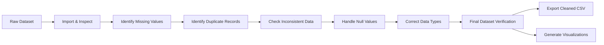

# Task 1 — Data Cleaning & Preprocessing

## Objective

Import and inspect the dataset, identify and handle data quality issues, and prepare a clean dataset for analysis.

## Deliverables

| Deliverable | Status |
|-------------|--------|
| Python/Jupyter Notebook | ✓ Complete |
| Dataset inspection | ✓ Complete |
| Missing-value analysis | ✓ Complete |
| Duplicate analysis | ✓ Complete |
| Inconsistency analysis | ✓ Complete |
| Data cleaning | ✓ Complete |
| Data-type correction | ✓ Complete |
| Final prepared dataset | ✓ Complete |
| **Bonus**: `cleaned_dataset.csv` | ✓ Complete |

## Files

- `data_cleaning.py` — Main data cleaning script
- `notebooks/data_cleaning.ipynb` — Interactive Jupyter notebook version
- `data/raw/superstore.csv` — Original raw dataset
- `data/processed/cleaned_dataset.csv` — Cleaned output dataset
- `visuals/missing_data_comparison.png` — Before/after missing values comparison
- `README.md` — This file

## Process Overview



## Steps Completed

1. **Dataset Import** — Loaded raw superstore.csv (9,994 rows × 22 columns)
2. **Structure Inspection** — Reviewed rows, columns, data types, sample records
3. **Missing Value Analysis** — Found 11 missing values in Postal Code column (0.11%)
4. **Duplicate Analysis** — Found 2 duplicate rows (1 actual duplicate pair)
5. **Inconsistent Data Check** — Verified OrderYear consistency with OrderDate
6. **Null Value Handling** — Filled missing Postal Code with mode value (10035)
7. **Data Type Correction**:
   - OrderDate: str → datetime64[us]
   - ShipDate: str → datetime64[us]
   - Postal Code: float64 → nullable Int64
   - Verified numeric column types
8. **Final Verification** — Confirmed no missing values, no duplicates
9. **Export** — Saved cleaned dataset (9,993 rows × 22 columns)
10. **Visualization** — Generated missing data comparison chart

## Key Findings

- **Original rows**: 9,994
- **After cleaning**: 9,993 (removed 1 duplicate)
- **Missing values handled**: 11 Postal Code values filled with mode (10035)
- **Data types corrected**: Date columns converted to datetime, Postal Code to integer
- **Final dataset**: Clean, ready for exploratory data analysis

## How to Run

```bash
# Using Python script
python data_cleaning.py

# Using Jupyter notebook
jupyter notebook notebooks/data_cleaning.ipynb
```

Outputs will be saved to the respective directories.

---

*Task completed: September 2026*